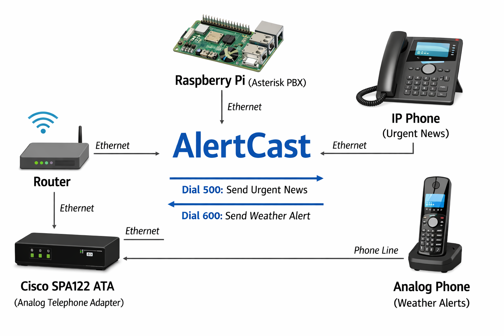
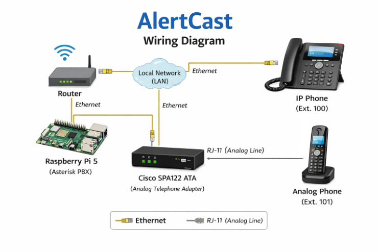

# AlertCast

## Description
AlertCast is a dual-phone system that uses a private SIP server to send automated voice alerts and updates. One phone is used for alerts while the other handles general information, and users can dial extensions to trigger messages between them.

## Why I Made This
I wanted to explore how phone systems work and combine analog and IP phones with automation to create a simple notification system.

## Features
- Dual-channel messaging (alerts + updates)
- Analog + IP phone integration
- Extension-based interaction
- Automated text-to-speech playback

## System Overview
- Raspberry Pi runs Asterisk PBX
- IP phone connects via SIP
- Analog phone connects via ATA
- Python scripts trigger calls and playback

## Images
## System Diagram

## Wiring Diagram

## 3D Model
(Add screenshot of CAD model here)

## BOM
*alternative: you can use a Raspberry Pi 4B (4gb)

| Item | Purpose | Quantity | Cost (USD) | Link | Distributor |
|------|--------|----------|------------|------|-------------|
| Cordless / Analog Handset Phone | The phone used for weather alerts | 1 | $23.25 | [Link](https://shorturl.at/lm3eZ) | Amazon |
| IP Phone | Main phone for receiving notifications | 1 | $40.00 | [Link](https://shorturl.at/J7IDi) | Amazon |
| RJ-11 Phone Line | Connects analog phone to ATA | 1 | $6.99 | [Link](https://shorturl.at/B4NFu) | Amazon |
| Cisco SPA122 ATA | Converts analog signals to SIP/VoIP | 1 | $55.95 | [Link](https://shorturl.at/er1GU) | Amazon / Cisco |
| 32GB MicroSD Card | Storage for Raspberry Pi OS | 1 | $20.50 | [Link](https://shorturl.at/9yTQH) | Amazon / SanDisk |
| Raspberry Pi 5B (8GB)* | Runs Asterisk PBX and TTS system | 1 | $81.99 | [Link](https://www.adafruit.com/product/5813) | adafruit |
